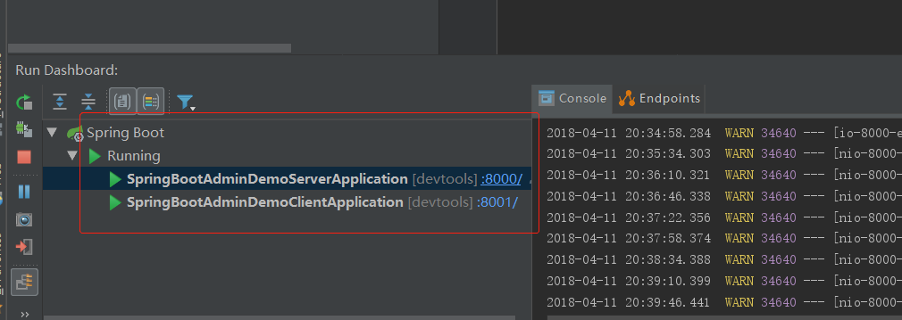
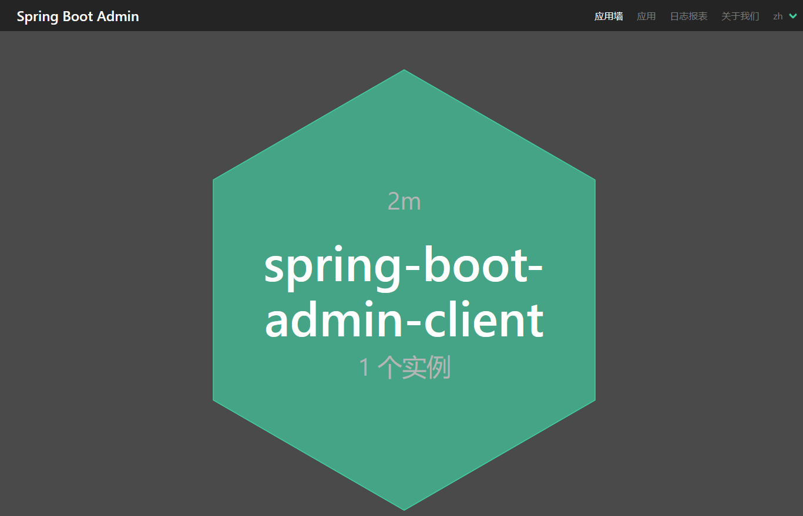
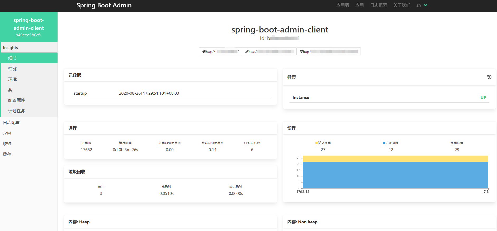
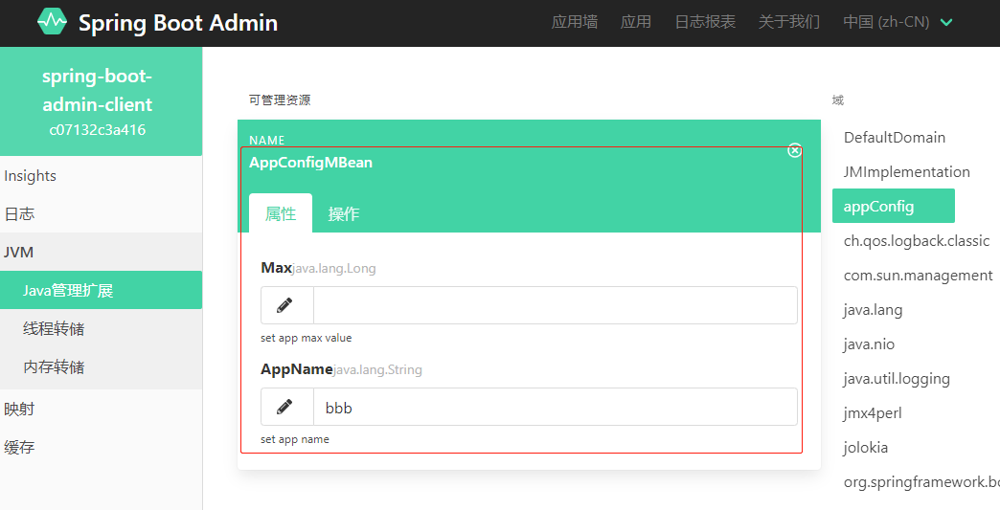

# spring-boot-admin-demo

> [spring-boot-admin](https://github.com/codecentric/spring-boot-admin/):Admin UI for administration of spring boot applications  
[github](https://github.com/netbuffer/spring-boot-admin-demo)  
[gitee](https://gitee.com/netbuffer/spring-boot-admin-demo) 
---

1. 启动server应用,client应用

2. 打开 [SBA](http://localhost:8000/) 管理端

3. 点击client应用  

4. mbean管理测试  
点击 [get appName](http://localhost:8001/appName) 测试jmx修改效果  
  

---
* `custom-ui`分支用来测试spring-boot-admin自定义UI

### articles
* [关于SpringBoot actuator的httptrace端点不生效问题解决办法](https://www.toutiao.com/i7013898442388865547)

### Docker Image
* https://hub.docker.com/r/javawiki/spring-boot-admin-demo-server
* https://hub.docker.com/r/javawiki/spring-boot-admin-demo-client
* docker run --rm -p 8000:8000 --name sbads javawiki/spring-boot-admin-demo-server:1.0.0
* docker run --rm -p 8001:8001 --link sbads -e SBAC_URL=http://sbads:8000 --name sbadc javawiki/spring-boot-admin-demo-client:1.0.0